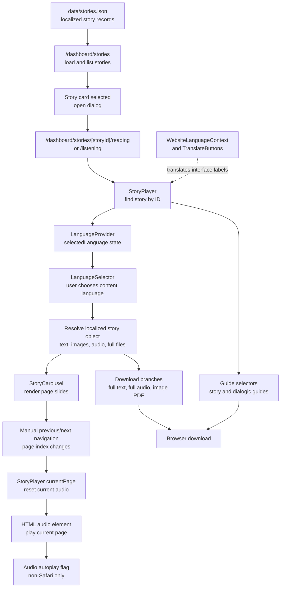
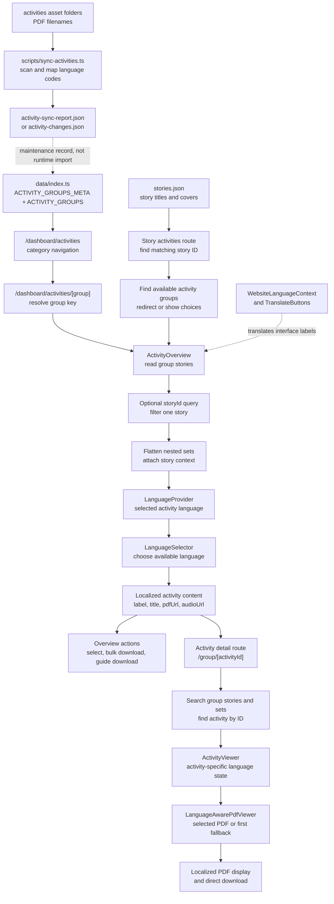

# Stories and Activities Architecture

This document describes how the frontend's story and activity functionality is connected at runtime. The diagrams are intentionally stacked from source data at the top to user-facing behavior at the bottom.

## Runtime Sources

Stories and activities use separate data models:

- `data/stories.json` is the runtime source for multilingual stories. It contains story IDs and slugs, localized titles, page text, images, per-page audio, complete audio files, and complete-text PDFs.
- `data/index.ts` is the runtime source for activities. It exports `ACTIVITY_GROUPS_META` for category navigation and `ACTIVITY_GROUPS` for stories, nested activity sets, activity metadata, and localized resources.
- `activity-changes.json` and `activity-sync-report.json` are generated reports. They record asset synchronization results but are not used by the pages to load activity data at request time.
- `scripts/sync-activities.ts` scans activity PDFs and can update the activity index. It is maintenance tooling, not part of the browser runtime.
- `data/index-updated.ts` and the `data/index (Kopie)*.ts` files are alternate or historical copies. The dashboard routes import `data/index.ts`.

## Story Functionality

### 1. Story catalogue and route selection

`app/dashboard/stories/page.tsx` imports `stories.json` and casts it to the `Story` type from `types/story.tsx`. It renders one card per story and uses `getStoryTitle`, `getStoryCoverImage`, and `getStoryLanguages` to choose display values for the current website language.

Selecting a card opens a dialog. The dialog links to the story's reading or listening route. The dynamic routes under `app/dashboard/stories/[storyId]/` validate the ID against `stories.json`, generate static parameters from the same data, and render `StoryPlayer`.

### 2. Content-language selection

`StoryPlayer` reads one story from `stories.json` using `storyId`. It creates the available language list by inspecting the localized fields on that story, then wraps the player in `LanguageProvider`.

`LanguageSelector` reads the provider state and renders one button for each available language. Selecting a language updates `selectedLanguage` in the provider and calls `StoryPlayer`'s language-change handler. The handler resets the page only when the current page does not exist in the new language and stops current playback.

This is separate from the website interface language managed by `WebsiteLanguageContext` and displayed through `TranslateButtons`. The website language controls labels such as "Play" and "Stories"; the content language controls which story text, images, and audio are loaded.

### 3. Localized pages and carousel

For the selected content language, `StoryPlayer` resolves the localized story object and converts its `pages` record into an ordered array. Each page contains text, an image URL, and an optional audio URL. Complete audio and text URLs are used by the download controls.

`StoryCarousel` receives the selected page array and renders one image/text slide per page. Its previous and next controls use the shared Embla carousel component. When the slide changes, it calls `onPageChange`, which updates `StoryPlayer`'s `currentPage`.

The carousel does not contain timer-based autoplay. Its navigation is manual. The separate audio autoplay behavior is described below.

### 4. Audio playback and autoplay

The current page's audio is rendered as an HTML `audio` element keyed by language, page, and fullscreen state. The Play button starts the current audio from the beginning and enables `audioAutoPlay`; Pause stops playback and disables it.

When a carousel page changes, `StoryPlayer` pauses and resets the audio element. If audio autoplay is enabled, it attempts to start the new page after the audio element has been recreated. Safari is detected and autoplay is disabled there because browser playback restrictions require explicit interaction.

The audio `ended` handler clears the playing indicator but keeps the autoplay flag enabled. It does not itself advance the carousel, so the current implementation should be understood as audio autoplay attached to manually selected slides, not as a fully automatic story-slide sequence.

### 5. Story downloads and guides

After a language is selected, the player can download:

- The localized complete text PDF from `fullText`.
- The localized complete audio file from `fullAudio`.
- A generated image PDF created from the current localized page images.
- A story reading guide, when `getStoryReadingGuide` reports one for the story and language.
- A dialogic reading guide, when the corresponding entry exists in `GUIDES`.

## Story Model



## Activity Functionality

### 1. Category and group navigation

`app/dashboard/activities/page.tsx` reads `ACTIVITY_GROUPS_META` and renders a link for each activity category. The metadata supplies the category label, slug, icon, colors, and description.

`app/dashboard/activities/[group]/page.tsx` receives the group key, resolves it against `ACTIVITY_GROUPS` and `ACTIVITY_GROUPS_META`, and renders `ActivityOverview`. The group page also provides a language-specific download for the category guide.

### 2. Activity data structure

Each `ACTIVITY_GROUPS[group]` entry contains a `stories` array. Each story has an ID, title, slug, description, and `sets`. `sets` is an array of activity arrays, so the page code flattens it before displaying activities.

Each activity has an ID and may have a type and description. Its `languages` object maps language codes to localized content containing a label, localized title, PDF URL, and optional audio URL. The activity ID is scoped by its story and group in the data, although the detail route searches within one group for a matching ID.

### 3. Overview filtering and downloads

`ActivityOverview` reads the selected group and optionally reads `storyId` from the URL query string. It filters the group's stories when that parameter is present, flattens all nested sets, and adds story context to each displayed activity.

The story title shown in the overview is looked up in `stories.json` using the story ID. This joins the activity model to the story model for presentation only; activity resources still come from `ACTIVITY_GROUPS`.

The overview creates a `LanguageProvider` for the activity language selector. Selecting a language determines which localized `pdfUrl` is used for individual or bulk downloads. Category-specific resource downloads, such as ICAU or PC resources, are handled as additional branches in the bulk-download logic.

### 4. Story-to-activity navigation

`app/dashboard/stories/[storyId]/activities/page.tsx` first finds the story in `stories.json` for its title and cover image. It then scans every activity group to find groups containing the same story ID. If there is one matching group, it redirects directly to that group's overview with `storyId` in the query string. If there are multiple groups, it displays the available categories.

### 5. Activity detail and localized PDF viewing

`app/dashboard/activities/[group]/[activityId]/page.tsx` maps the URL slug back to an activity group key, searches the group's nested sets, and passes the matching activity and story information to `ActivityViewer`.

`ActivityViewer` builds language options from the activity's own `languages` object. A language change updates the selected activity language. `LanguageAwarePdfViewer` then displays the selected language's PDF and falls back to the first available PDF if the selected language has no URL. The Download button downloads the selected localized PDF directly.

`lib/activity-utils.tsx` contains a second flattening and lookup abstraction through `getAllActivities` and `getActivityBySlug`. The current dashboard pages primarily perform their own direct group and nested-set lookups, so this helper should be treated as an available utility rather than the sole route data path.

## Activity Model



## Boundaries and Caveats

- Website interface language and content language are different states. `TranslateButtons` uses the website language, while `LanguageProvider` selects story or activity resources.
- Stories and activities are not generated from one another at runtime. They are separate sources joined mainly by matching story IDs.
- Story language data is shaped around localized story records and page maps. Activity language data is shaped around localized resource URLs. The two models should not be treated as interchangeable.
- Some language codes are inconsistent across files, such as `de`, `de-lang`, `deshort`, `svn`, and `sv`. Helper functions and local fallback logic handle some variants, but availability depends on the actual keys present in each record.
- Missing activity PDFs may fall back to the first available activity PDF in `LanguageAwarePdfViewer`; missing story content may fall back to English in the relevant story helpers or pipeline paths.
- The activity synchronization reports describe filesystem state at the time they were generated. They do not prove that every reported asset is present in the current runtime data or public asset tree.
- The story carousel has manual navigation. Audio autoplay is a separate, user-started behavior and is disabled on Safari.


## Data Lineage and Runtime Model

The application uses local, typed content sources rather than a content API.

`stories.json` and `data/index.ts` are imported into Next.js modules. The application then dynamically selects and transforms records using route parameters, language state, and URL query parameters.

In this project, “dynamic” means runtime selection from imported local data. Story and activity records are not fetched from a remote API during normal browser use.

```mermaid
flowchart TD
    A["stories.json"] --> B["Story type helpers"]
    B --> C["Story catalogue"]
    B --> D["Story route validation"]
    B --> E["StoryPlayer"]

    E --> F["storyId lookup"]
    E --> G["Content-language selection"]
    G --> H["Localized story record"]
    H --> I["Pages, images, page audio"]
    H --> J["Full audio and PDF URLs"]

    K["data/index.ts"] --> L["ACTIVITY_GROUPS_META"]
    K --> M["ACTIVITY_GROUPS"]
    M --> N["Group route lookup"]
    M --> O["Nested story and activity sets"]

    O --> P["storyId query filtering"]
    O --> Q["Activity ID lookup"]
    P --> R["ActivityOverview"]
    Q --> S["ActivityViewer"]
    R --> T["Localized activity PDF/audio"]
    S --> U["LanguageAwarePdfViewer"]

    V["public/activities assets"] --> T
    V --> U

    W["sync-activities.ts"] --> X["Filesystem scan"]
    X --> Y["Change reports"]
    Y -. "maintenance information only" .-> K

    Z["Flask backend"] -. "separate application boundary" .-> AA["Authentication and user endpoints"]
    ```

Runtime Selection Mechanisms
The application selects data through several mechanisms:

storyId route parameters select one story from stories.json.
Activity group slugs are resolved against ACTIVITY_GROUPS_META.
Activity IDs are searched inside the selected activity group.
The storyId query parameter filters activities for one story.
Website language selects interface labels and navigation text.
Content language selects story pages, activity PDFs, audio, and guides.
Story helper functions provide localized titles and images with English fallback behavior.
Activity viewers fall back to another available PDF when the selected language has no PDF URL.
Missing or invalid route records result in notFound() or an empty-state response.
Story pages are generated from localized page records and displayed through the carousel.
Story image PDFs are generated in the browser from the currently selected page images.
Application Boundaries
Next.js frontend
The Next.js application owns:

Story and activity catalogue pages.
Dynamic story and activity routes.
Language selection state.
Story carousel navigation.
Audio playback.
PDF and audio downloads.
Browser-generated image PDFs.
Interface translations.
Static route generation.
Local content data
The frontend imports these sources at build time or module load time:

data/stories.json for story records.
data/index.ts for activity records and activity-group metadata.
Guide definitions exported from data/index.ts.
Translation resources used by interface components.
These files behave like a local content database, but they are not queried through a database client.

Public assets
The public directory serves browser-accessible assets such as:

Story images.
Activity PDFs.
Activity guides.
Audio files.
Other downloadable resources.
The JSON and TypeScript records contain URLs pointing to these assets.

Maintenance tooling
scripts/sync-activities.ts scans activity folders and parses filenames to identify:

Story IDs.
Activity groups.
Activity numbers.
Language codes.
PDF locations.
The script maps filename language codes such as E, F, G, GR, and SVN to application language keys. It can propose or apply changes to the activity index and produces synchronization information.

The synchronization reports are maintenance outputs. They are not imported by dashboard pages and do not replace data/index.ts as the runtime activity source.

Flask backend
The Flask backend is a separate application boundary. It currently provides basic user and authentication-style routes and database configuration. It does not currently serve stories.json, data/index.ts, story pages, or activity resources.

Mechanisms a Complete Architecture Model Should Display
A complete model should show the following mechanisms:

Data provenance

Where records originate and whether they are local, generated, remote, or user-created.

Data transformation

Type assertions, fallback helpers, language-code mapping, activity-set flattening, and story/activity joining.

Routing

Static parameter generation, route validation, URL slug resolution, query-string filtering, redirects, and notFound() behavior.

Runtime state

Website language, content language, current story page, audio playback state, fullscreen state, selected activities, and selected downloads.

Asset resolution

Story images, page audio, complete story audio, story PDFs, activity PDFs, guide PDFs, and browser-generated PDFs.

Fallback behavior

English story fallback, placeholder images, first-available activity PDFs, missing-guide handling, missing language handling, and invalid route handling.

User interactions

Story selection, reading mode, listening mode, language switching, carousel navigation, audio controls, individual downloads, bulk downloads, and guide downloads.

Build and maintenance behavior

generateStaticParams(), activity folder scanning, filename parsing, index updates, generated reports, and the difference between maintenance output and runtime data.

Application boundaries

Next.js frontend, local content files, public assets, Flask backend, database configuration, and authentication routes.

Validation and observability

Route validation, missing-content checks, console logging, synchronization warnings, download errors, and potential schema validation.

### Important Caveats
Story content is locally imported, not fetched through an API.
Activity synchronization does not automatically make filesystem assets available to the browser.
The checked-in activity index remains the runtime source after synchronization.
Website interface language and content language are separate state systems.
LanguageProvider is reused for stories, activities, and guide downloads.
Activity IDs may not be globally unique because they are scoped by group and story.
The activity route should consistently distinguish activity group keys from activity group slugs.
The listening route currently uses a hardcoded website language value.
getActivityBySlug() creates a module-level flattened activity collection, while dashboard routes also perform direct nested lookups.
Some language codes are inconsistent across source files, including de, deshort, svn, sv, and gr.
The Flask backend is not currently the source of story or activity content.
